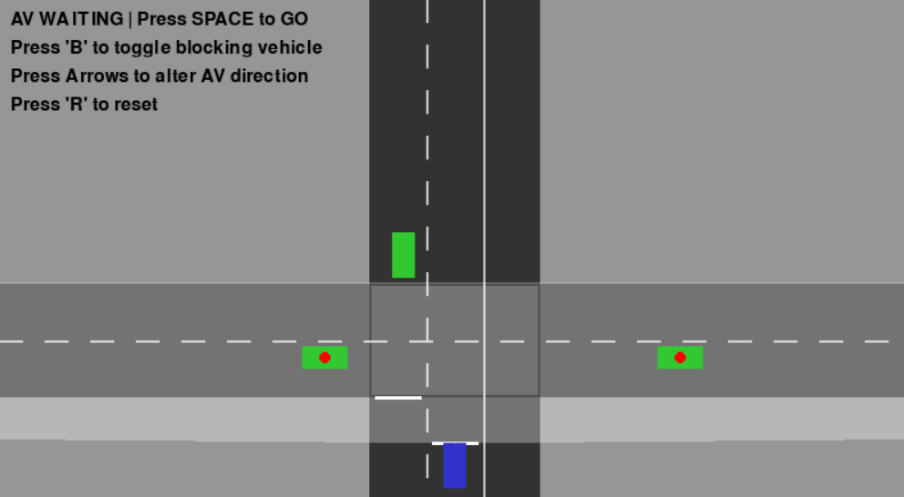

The following files are used to simulate AV decision algorithms at intersections with staggered stop lines. The simulator uses the Australian driving convention - i.e. cars are driving on the left-hand side of the road.

This simulator uses the following layout:

